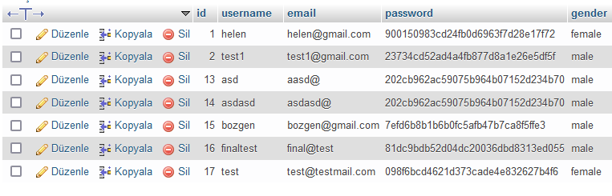

# Assignment-6

In this assignment firstly I created a database and a table for users. The php code was already provided so the aim was to get the client to successfully register and login. 

I created 2 pages for login and register. The homepage is already created automatically with a blank project. I haven't paid attention to styling this one because that was not the point.

After a successful login, profile details of the user is shown in the homepage. I achieved this via React Context API.

Root path is register page. If succesfully registered, app redirects to login page. And if succesfully logged in, app redirects to homepage. You cannot access the homepage before logging in which is the whole point of authentication.

Some screenshots are added below:

## Register Page 

## Login Page 

## Homepage (profile details)

## Database table

